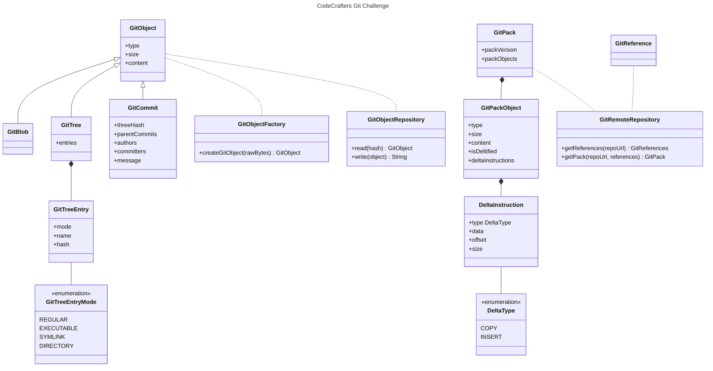

# Solving the Git Challenge

Note that this is not a repository showcasing a proper architecture fit for production use. Just use
it as inspiration when trying to solve the Git challenge yourself.

## High-Level Model

